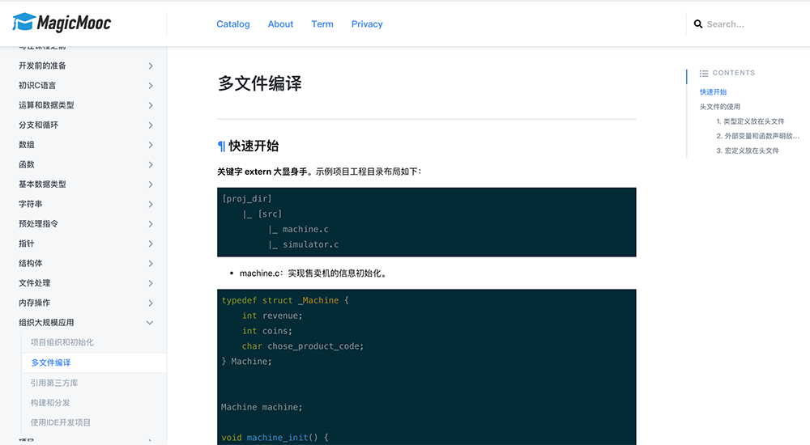

A Magic MOOC Platform.

## Preivew

https://mooc.banyuan.club

## The project build with below these technologies

* react (hook)
* redux
* react-rouer
* formik，yup
* axios (RESTfull Style)

## Run the app in the development mode.

`yarn start`

## Launches the test runner in the interactive watch mode.

`yarn test`

## Builds the app for the production to the `build` folder.
`yarn build`
